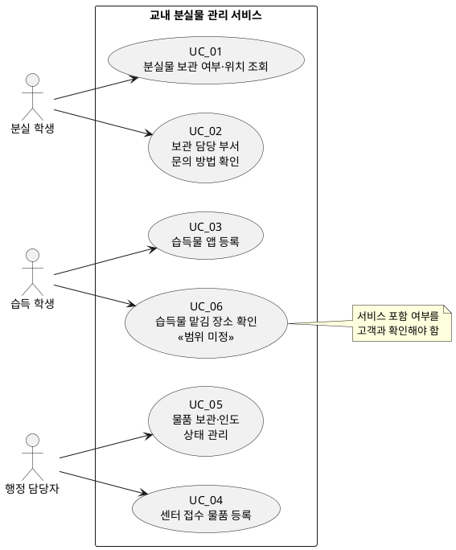

# Use Case 식별서 v0.1

| 항목 | 내용 |
|---|---|
| 목적 | 교내 분실물 관리 서비스에서 사용자가 달성하려는 목표를 중심으로 Use Case를 식별한다. |
| 근거 문서 | `고객 요구사항.md`, `SRS_v0.1.md` |
| 범위 | 확정된 조회, 습득 학생 앱 등록, 센터 접수 물품 등록, 상태 관리, 문의 안내 기능 및 범위 미정인 습득물 맡김 장소 안내 |
| 제외 범위 | 사진 기반 유사 물품 조회, 사진 매칭 자동 알림, 개인 휴대전화 번호 공개, 실제 학교 인증 연동 |

## 1. 액터 목록

| ID | 액터 | 구분 | 역할 및 관심사 |
|---|---|---|---|
| ACT_01 | 분실 학생 | 주 액터 | 방문 전에 분실물의 보관 여부와 위치를 확인하고, 보관 담당 부서에 문의하는 방법을 알고자 한다. |
| ACT_02 | 습득 학생 | 주 액터 | 자신이 습득한 물품을 앱에서 바로 등록하고자 한다. 습득물 맡김 장소 안내의 서비스 포함 여부는 미정이다. |
| ACT_03 | 행정 담당자 | 주 액터 | 분실물 센터로 접수된 습득 물품을 등록하고 보관·인도 상태를 관리하고자 한다. |
| ACT_04 | 정보보호 담당자 | 이해관계자 | 조회 화면에서 공개할 정보의 범위를 검토한다. 현재 요구사항에는 시스템을 직접 조작하는 기능이 정의되지 않았다. |
| ACT_05 | 서비스 운영 책임자 | 이해관계자 | 운영 정책, 책임 및 미정 사항을 결정한다. 현재 요구사항에는 시스템을 직접 조작하는 기능이 정의되지 않았다. |

## 2. Use Case 목록

| ID | Use Case | 액터 | 사용자 목표(왜) | 개요 | 상태 |
|---|---|---|---|---|---|
| UC_01 | 분실물 보관 여부·위치 조회 | ACT_01 분실 학생 | 행정실을 방문하기 전에 물품이 보관되어 있는지와 어디에 있는지를 알고 불필요한 방문·반복 문의를 줄인다. | 학생이 물품을 조회하고, 공개가 허용된 보관 여부와 위치를 확인한다. | 확정 |
| UC_02 | 보관 담당 부서 문의 방법 확인 | ACT_01 분실 학생 | 조회만으로 해결되지 않는 경우 담당 부서에 올바른 방법으로 문의한다. | 학생이 담당 부서와 문의 방법 안내를 확인한다. | 확정 |
| UC_03 | 습득물 앱 등록 | ACT_02 습득 학생 | 습득한 물품을 발견 즉시 서비스에 알리고, 분실물이 관리될 수 있게 한다. | 습득 학생이 자신이 습득한 물품을 앱에서 바로 등록한다. | 확정 |
| UC_04 | 센터 접수 물품 등록 | ACT_03 행정 담당자 | 분실물 센터로 접수된 습득 물품을 관리 대상에 반영한다. | 행정 담당자가 센터 접수 물품 정보를 등록한다. | 확정 |
| UC_05 | 물품 보관·인도 상태 관리 | ACT_03 행정 담당자 | 이미 인도한 물품과 아직 보관 중인 물품을 구분해 정확히 관리한다. | 담당자가 물품 상태를 기록하고 `보관 중` 또는 `인도 완료`로 구분한다. | 확정 |
| UC_06 | 습득물 맡김 장소 확인 | ACT_02 습득 학생 | 주운 물건을 올바른 장소에 맡긴다. | 학생이 습득물 접수 장소 안내를 확인한다. | 범위 미정 |

## 3. Use Case Diagram

## 4. 질문 사항

| ID | 질문 사항 | 영향 Use Case | 확인 필요 대상 |
|---|---|---|---|
| Q_01 | 분실 학생은 어떤 조건(예: 물품명, 습득일, 분류)으로 분실물을 조회해야 하는가? | UC_01 | 행정 담당자, 서비스 운영 책임자 |
| Q_02 | UC_01의 결과 화면에 보관 여부·위치 외에 어떤 물품 정보를 공개할 수 있는가? | UC_01 | 정보보호 담당자 |
| Q_03 | 보관 위치는 어느 수준까지 공개해야 하는가(예: 담당 부서명만, 건물·창구 포함)? | UC_01 | 정보보호 담당자, 행정 담당자 |
| Q_04 | 담당 부서 문의 안내에 포함할 정보는 무엇인가(예: 부서명, 방문 가능 시간, 전화번호, 이메일)? 개인 연락처와 대표 문의 채널은 어떻게 구분하는가? | UC_02 | 행정 담당자, 정보보호 담당자 |
| Q_05 | 습득 학생이 앱에서 물품을 등록할 때 필요한 입력 정보와 등록 직후 안내할 내용은 무엇인가? | UC_03 | 행정 담당자, 서비스 운영 책임자 |
| Q_06 | 행정 담당자가 센터 접수 물품을 등록할 때 필요한 입력 정보와 등록 권한은 무엇인가? | UC_04 | 행정 담당자, 서비스 운영 책임자 |
| Q_07 | 습득 학생의 앱 등록 정보와 센터 접수 물품 정보가 동일 물품일 경우, 어떻게 확인·처리할 것인가? | UC_03, UC_04 | 행정 담당자, 서비스 운영 책임자 |
| Q_08 | 누가 어떤 조건에서 물품 상태를 `보관 중` 또는 `인도 완료`로 변경·정정할 수 있는가? | UC_05 | 행정 담당자, 서비스 운영 책임자 |
| Q_09 | 습득물 맡김 장소 안내를 서비스에 포함할 것인가? 포함한다면 안내할 장소와 운영 시간은 무엇인가? | UC_06 | 서비스 운영 책임자, 행정 담당자 |
| Q_10 | 행정 담당자의 센터 접수 물품 등록 부담을 측정할 현재 기준선과 개선 목표는 무엇인가? | UC_04 | 행정 담당자, 서비스 운영 책임자 |
| Q_11 | 실제 학교 인증 연동 없이 행정 담당자의 등록·상태 관리 권한을 어떻게 구분할 것인가? | UC_04, UC_05 | 서비스 운영 책임자 |
