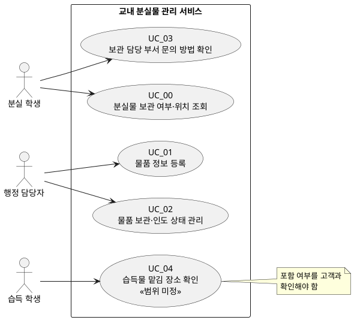

# 소프트웨어 요구사항 명세서 v0.1 — 분실물 서비스

| 항목 | 내용 |
|---|---|
| 입력 원문 | `고객 요구사항.md` |
| 문서 목적 | 고객 요구를 개발·검증 가능한 소프트웨어 요구사항 초안으로 구조화한다. |
| 작성 원칙 | 원문에서 확정된 내용은 **확정**, 결정되지 않은 내용은 **질문**, 원문을 구현 가능한 형태로 정리하기 위한 의견은 **제안**으로 구분한다. 질문과 제안은 확정 요구사항이 아니다. |
| 이번 범위 | 분실물 조회, 행정 담당자의 물품 등록, 보관·인도 상태 구분, 담당 부서 문의 방법 안내 |
| 제외 범위 | 사진 기반 유사 물품 조회, 사진 매칭 자동 알림, 개인 휴대전화 번호 공개, 실제 개인정보 사용, 실제 학교 인증 연동 |

## 1. 공통 정책

### 1.1 업무 규칙·범위 정책

| ID | 구분 | 업무 규칙 또는 정책 | 원문 근거 | 개발·검증 반영 |
|---|---|---|---|---|
| POL_00 | 확정 | 조회 화면에는 조회 목적에 필요한 정보만 공개한다. | NEEDS_6, S4 | 공개 항목이 확정되기 전까지 개인 정보 및 불필요한 세부 정보는 표시하지 않는다. |
| POL_01 | 확정 | 개인 휴대전화 번호를 공개하지 않는다. | NEEDS_6, SC8 | 조회 결과와 문의 안내에서 개인 휴대전화 번호가 노출되지 않아야 한다. |
| POL_02 | 확정 | 개발·테스트·시연에는 가상 데이터만 사용하고 실제 개인정보를 사용하지 않는다. | C_1 | 저장·표시·테스트 데이터에 실제 개인정보를 포함하지 않는다. |
| POL_03 | 확정 | 실제 학교 인증 연동은 이번 범위에서 제외한다. | C_1 | 학교 계정, SSO 등 실제 인증 연동을 구현하지 않는다. |
| POL_04 | 확정 | 사진 업로드 기반 유사 분실물 조회는 이번 범위에서 제외한다. | SC5 | 사진 등록·비교·매칭 기능을 제공하지 않는다. |
| POL_05 | 확정 | 사진 매칭 결과의 자동 알림은 이번 범위에서 제외한다. | SC7 | 수신 정보 등록, 알림 발송, 자동 통지 기능을 제공하지 않는다. |
| POL_06 | 질문 | 습득물을 맡길 장소 안내를 서비스에 포함할지 결정해야 한다. | NEEDS_5, SC4 | 포함 결정 전에는 구현 범위에 넣지 않는다. |
| POL_07 | 제안 | 공개 가능한 물품 정보와 위치 정보의 항목을 정보보호 담당자가 승인한 목록으로 관리한다. | S4, NEEDS_6 | 승인 목록을 확정한 뒤 화면 표시·테스트 기준으로 사용한다. |

### 1.2 미정 질문

| ID | 질문 | 원문 근거 | 영향 영역 |
|---|---|---|---|
| Q_00 | 분실물 조회에 사용할 검색 조건은 무엇인가? | SC1, NEEDS_1 | UC_00, FR_00 |
| Q_01 | 조회 결과에서 보관 여부·위치 외에 공개할 물품 정보와 위치 상세 수준은 무엇인가? | SC1, NEEDS_6 | UC_00, FR_01, FR_06 |
| Q_02 | 물품 등록의 필수 입력 항목과 등록 권한은 무엇인가? | SC2, NEEDS_2 | UC_01, FR_02 |
| Q_03 | 물품 상태를 변경·정정할 수 있는 주체와 절차는 무엇인가? | SC3, NEEDS_3 | UC_02, FR_03, FR_04 |
| Q_04 | 문의 안내에 표시할 담당 부서명, 운영 시간, 대표 연락 채널은 무엇인가? | SC6, NEEDS_4 | UC_03, FR_05 |
| Q_05 | 행정 담당자 등록 업무의 현재 소요 시간, 측정 방법, 개선 목표는 무엇인가? | NEEDS_7 | NFR_03 |
| Q_06 | 습득물 맡김 장소 안내를 제품에 포함할 것인가? | S3, SC4 | 후보 UC, POL_06 |

## 2. 사용자 목표와 Use Case 모델

### 2.1 사용자 목표

| ID | 사용자 | 무엇을 하는가 | 얻는 가치 |
|---|---|---|---|
| GOAL_00 | 분실 학생 | 방문 전에 분실물의 보관 여부와 위치를 조회한다. | 불필요한 행정실 방문과 반복 문의를 줄인다. |
| GOAL_01 | 분실 학생 | 보관 담당 부서와 문의 방법을 확인한다. | 문의가 필요한 경우 올바른 창구로 연락할 수 있다. |
| GOAL_02 | 행정 담당자 | 조회 대상 물품을 등록한다. | 반복 문의에 대응할 수 있는 물품 정보를 제공한다. |
| GOAL_03 | 행정 담당자 | 물품의 보관·인도 상태를 기록하고 구분한다. | 보관 중 물품과 인도 완료 물품을 명확히 관리한다. |
| GOAL_04 | 습득 학생 | 습득물을 맡길 장소를 확인한다. | 주운 물건을 올바른 장소에 인계한다. (범위 미정) |

### 2.2 액터 목록

| ID | 액터 | 유형 | 역할 |
|---|---|---|---|
| ACT_00 | 분실 학생 | 주 액터 | 분실물 조회와 문의 방법 확인을 수행한다. |
| ACT_01 | 행정 담당자 | 주 액터 | 물품 등록과 상태 관리를 수행한다. |
| ACT_02 | 습득 학생 | 후보 액터 | 습득물 맡김 장소를 확인한다. 해당 기능은 범위 미정이다. |
| ACT_03 | 정보보호 담당자 | 이해관계자 | 공개 정보 범위를 검토한다. 시스템 조작 기능은 원문에 정의되지 않았다. |
| ACT_04 | 서비스 운영 책임자 | 이해관계자 | 운영 정책과 미정 사항을 결정한다. 시스템 조작 기능은 원문에 정의되지 않았다. |

### 2.3 Use Case 목록

| ID | UC명 | 액터 | 사용자 목표 | 상태 | 출처 |
|---|---|---|---|---|---|
| UC_00 | 분실물 보관 여부·위치 조회 | ACT_00 | 보관 여부와 위치를 확인하여 방문·문의 부담을 줄인다. | 확정 | S1, SC1, NEEDS_1 |
| UC_01 | 물품 정보 등록 | ACT_01 | 조회 가능한 물품 정보를 등록하여 물품 관리를 지원한다. | 확정 | S2, SC2, NEEDS_2 |
| UC_02 | 물품 보관·인도 상태 관리 | ACT_01 | 보관 중과 인도 완료 물품을 구분해 관리한다. | 확정 | S2, SC3, NEEDS_3 |
| UC_03 | 보관 담당 부서 문의 방법 확인 | ACT_00 | 담당 부서와 문의 방법을 확인한다. | 확정 | S5, SC6, NEEDS_4 |
| UC_04 | 습득물 맡김 장소 확인 | ACT_02 | 습득물을 올바른 장소에 인계한다. | 범위 미정 | S3, SC4, NEEDS_5 |

### 2.4 Use Case 다이어그램

### 2.5 액터–Use Case 연결표

| 액터 | UC_00 조회 | UC_01 등록 | UC_02 상태 관리 | UC_03 문의 방법 | UC_04 맡김 장소 |
|---|---:|---:|---:|---:|---:|
| 분실 학생(ACT_00) | 수행 | - | - | 수행 | - |
| 행정 담당자(ACT_01) | - | 수행 | 수행 | - | - |
| 습득 학생(ACT_02) | - | - | - | - | 후보 |

## 3. 유스케이스(UC) 명세

### UC_00 — 분실물 보관 여부·위치 조회

| 항목 | 명세 |
|---|---|
| ID / UC명 | UC_00 / 분실물 보관 여부·위치 조회 |
| 목표 | 분실 학생이 방문 전에 보관 여부와 공개 허용 범위의 위치를 확인한다. |
| 액터 | 분실 학생(ACT_00) |
| 출처 | S1, SC1, NEEDS_1, NEEDS_6 |
| 사전 조건 | 조회 가능한 물품 정보가 등록되어 있을 수 있다. 검색 조건과 공개 항목은 확정이 필요하다. |
| 트리거 | 분실 학생이 분실물 조회를 선택한다. |
| 기본 흐름 | 1. 학생이 검색 조건을 입력한다.   2. 시스템이 조건에 맞는 등록 물품을 검색한다.   3. 시스템이 공개 허용 정보만 사용해 보관 여부와 위치를 표시한다.   4. 학생이 결과를 확인한다. |
| 대안 흐름 | A1. 2단계에서 일치 물품이 없으면, 시스템은 결과 없음을 알리고 UC_03의 문의 방법 확인을 안내한다.   A2. 3단계에서 공개 제한 정보가 포함되면, 시스템은 제한 정보를 제외하고 허용된 정보만 표시한다. |
| 예외 흐름 | E1. **[논의]** 검색 조건이 불충분하여 유사 결과가 다수이면, 정렬·필터·재검색 방식이 정해지지 않았다. 결정 전에는 결과를 제공하거나 검색 조건을 수정하게 하는 방식을 확정해야 한다. |
| 사후 조건 | **성공:** 학생이 보관 여부와 공개된 위치 정보를 확인한다.   **실패:** 물품 정보는 변경되지 않는다.   **취소:** 조회를 취소해도 물품 정보와 개인정보는 변경되지 않는다. 조회·취소 이력 보존 여부는 미정이다. |

### UC_01 — 물품 정보 등록

| 항목 | 명세 |
|---|---|
| ID / UC명 | UC_01 / 물품 정보 등록 |
| 목표 | 행정 담당자가 조회 가능한 물품 정보를 등록한다. |
| 액터 | 행정 담당자(ACT_01) |
| 출처 | S2, SC2, NEEDS_2 |
| 사전 조건 | 담당자가 등록 업무를 수행할 수 있다. 필수 입력 항목과 권한 판별 방법은 미정이다. |
| 트리거 | 행정 담당자가 물품 등록을 선택한다. |
| 기본 흐름 | 1. 담당자가 물품 정보를 입력한다.   2. 시스템이 입력값을 검증한다.   3. 시스템이 물품 정보를 저장한다.   4. 시스템이 등록 완료를 표시한다. |
| 대안 흐름 | A1. 2단계에서 필수 입력 누락 또는 형식 오류가 있으면, 시스템은 오류 항목을 표시하고 담당자가 1단계로 돌아가 수정한다. |
| 예외 흐름 | E1. **[논의]** 권한 없는 사용자의 등록 시도에 대한 식별·거부 방식은 실제 학교 인증 연동 제외 제약 때문에 정해지지 않았다. |
| 사후 조건 | **성공:** 물품 정보가 저장되어 조회·상태 관리의 대상이 된다.   **실패:** 검증을 통과하지 못한 정보는 저장하지 않는다.   **취소:** 저장 전 취소 시 새 물품 정보는 생성되지 않으며, 임시 입력값 보존 여부는 미정이다. |

### UC_02 — 물품 보관·인도 상태 관리

| 항목 | 명세 |
|---|---|
| ID / UC명 | UC_02 / 물품 보관·인도 상태 관리 |
| 목표 | 행정 담당자가 보관 중 물품과 인도 완료 물품을 구분하여 관리한다. |
| 액터 | 행정 담당자(ACT_01) |
| 출처 | S2, SC3, NEEDS_3 |
| 사전 조건 | 상태를 관리할 물품 정보가 등록되어 있다. 상태 변경·정정 권한과 절차는 미정이다. |
| 트리거 | 담당자가 물품의 상태 기록 또는 변경을 선택한다. |
| 기본 흐름 | 1. 담당자가 물품을 선택한다.   2. 시스템이 현재 상태를 표시한다.   3. 담당자가 `보관 중` 또는 `인도 완료` 상태를 기록·변경한다.   4. 시스템이 상태를 저장하고 결과를 표시한다. |
| 대안 흐름 | A1. 1단계에서 대상 물품이 없으면, 시스템은 대상 물품을 찾을 수 없음을 표시하고 물품 선택 단계로 복귀하거나 종료한다. |
| 예외 흐름 | E1. **[논의]** `인도 완료` 상태를 `보관 중`으로 정정하려는 경우의 승인자, 정정 조건, 이력 보존 규칙이 정해지지 않았다. 규칙 확정 전에는 정정을 저장하지 않는다. |
| 사후 조건 | **성공:** 물품 상태가 `보관 중` 또는 `인도 완료`로 저장되어 조회에 반영된다.   **실패·취소:** 기존 상태를 보존한다. 상태 변경 이력의 보존 여부는 미정이다. |

### UC_03 — 보관 담당 부서 문의 방법 확인

| 항목 | 명세 |
|---|---|
| ID / UC명 | UC_03 / 보관 담당 부서 문의 방법 확인 |
| 목표 | 분실 학생이 필요한 경우 올바른 담당 부서에 문의한다. |
| 액터 | 분실 학생(ACT_00) |
| 출처 | S5, SC6, NEEDS_4, NEEDS_6 |
| 사전 조건 | 담당 부서와 문의 방법 정보가 등록되어 있다. 표시 항목은 미정이다. |
| 트리거 | 학생이 조회 화면 또는 서비스 메뉴에서 문의 방법 확인을 선택한다. |
| 기본 흐름 | 1. 학생이 문의 방법 확인을 선택한다.   2. 시스템이 담당 부서와 허용된 문의 방법을 표시한다.   3. 학생이 안내를 확인한다. |
| 대안 흐름 | A1. 2단계에서 문의 정보가 등록되지 않았으면, 시스템은 안내를 제공할 수 없음을 표시하고 종료한다. |
| 예외 흐름 | E1. 개인 휴대전화 번호가 표시 후보에 있으면, 시스템은 해당 번호를 제외한다. 대표 문의 채널이 없을 때의 안내는 **[논의]**가 필요하다. |
| 사후 조건 | **성공:** 학생이 개인 연락처 없이 담당 부서의 문의 방법을 확인한다.   **실패·취소:** 물품 정보와 개인정보는 변경되지 않는다. |

### UC_04 — 습득물 맡김 장소 확인 (범위 미정)

| 항목 | 명세 |
|---|---|
| ID / UC명 | UC_04 / 습득물 맡김 장소 확인 |
| 목표 | 습득 학생이 주운 물건을 올바른 장소에 맡긴다. |
| 액터 | 습득 학생(ACT_02) |
| 출처 | S3, SC4, NEEDS_5 |
| 사전 조건 | 이 기능을 서비스에 포함하기로 결정하고, 접수 장소 정보가 등록되어 있다. |
| 트리거 | 습득 학생이 맡김 장소 안내를 선택한다. |
| 기본 흐름 | 1. 학생이 맡김 장소 안내를 선택한다.   2. 시스템이 접수 장소 및 필요한 안내를 표시한다.   3. 학생이 안내를 확인한다. |
| 대안 흐름 | A1. 접수 장소 정보가 없으면, 시스템은 안내를 제공할 수 없음을 표시하고 종료한다. |
| 예외 흐름 | E1. **[논의]** 서비스 범위에서 제외하기로 결정되면 이 UC를 구현하지 않으며, 기존 외부 안내를 제공할지 결정해야 한다. |
| 사후 조건 | **성공:** 학생이 접수 장소 안내를 확인한다.   **실패·취소:** 물품 정보는 변경되지 않는다. |

## 4. 기능 요구사항

| ID | 기능 요구사항 | 연결 UC·단계 | 출처 | 검증 기준 |
|---|---|---|---|---|
| FR_00 | 시스템은 분실 학생이 분실물의 보관 여부를 조회할 수 있도록 해야 한다. | UC_00 기본 흐름 1~4 | NEEDS_1, SC1 | 등록된 물품과 일치하는 조회 요청 시 보관 여부를 확인할 수 있다. |
| FR_01 | 시스템은 조회 결과에 공개가 허용된 보관 위치를 표시해야 한다. | UC_00 기본 흐름 3 | NEEDS_1, SC1 | 정책상 허용된 위치 정보만 표시된다. 위치 상세 수준은 Q_01 결정 후 검증한다. |
| FR_02 | 시스템은 행정 담당자가 조회 대상 물품 정보를 등록할 수 있도록 해야 한다. | UC_01 기본 흐름 1~4 | NEEDS_2, SC2 | 유효한 등록 정보를 저장하면 조회·상태 관리 대상으로 사용할 수 있다. 필수 항목은 Q_02 결정 후 검증한다. |
| FR_03 | 시스템은 행정 담당자가 물품의 보관 상태를 기록하고 관리할 수 있도록 해야 한다. | UC_02 기본 흐름 1~4 | NEEDS_3, SC3 | 등록된 물품의 상태를 기록하고 이후 조회에 반영할 수 있다. |
| FR_04 | 시스템은 물품 상태를 최소한 `보관 중`과 `인도 완료`로 구분해 표시해야 한다. | UC_02 기본 흐름 3~4 | NEEDS_3, SC3 | 두 상태가 서로 구분되어 표시된다. |
| FR_05 | 시스템은 분실 학생에게 보관 담당 부서와 문의 방법을 안내해야 한다. | UC_03 기본 흐름 1~3 | NEEDS_4, SC6 | 등록된 담당 부서와 허용된 문의 방법이 표시된다. 표시 항목은 Q_04 결정 후 검증한다. |
| FR_06 | 시스템은 조회 화면에 공개가 허용된 정보만 표시해야 한다. | UC_00 기본 흐름 3, UC_03 기본 흐름 2 | NEEDS_6, S4 | 공개 제한 정보와 개인 휴대전화 번호가 화면에 표시되지 않는다. |

## 5. 비기능 요구사항

| ID | 구분 | 비기능 요구사항 또는 제약 조건 | 출처 | 검증 기준 |
|---|---|---|---|---|
| NFR_00 | 개인정보 보호 | 시스템은 조회 화면과 문의 안내에 개인 휴대전화 번호를 표시해서는 안 된다. | NEEDS_6, SC8 | 테스트 데이터에 개인 휴대전화 번호가 있어도 조회·문의 화면에 나타나지 않는다. |
| NFR_01 | 데이터 제약 | 시스템은 실제 개인정보를 저장·처리·표시하지 않고 가상 데이터만 사용해야 한다. | C_1 | 테스트·시연 데이터에 실제 개인정보가 포함되지 않는다. |
| NFR_02 | 사용성 | 분실 학생은 행정실 방문 전에 보관 여부, 보관 위치, 문의 방법을 확인할 수 있어야 한다. | NEEDS_1, NEEDS_4 | UC_00과 UC_03을 통해 필요한 정보를 확인할 수 있다. 화면 구성의 정량 목표는 원문에 없다. |
| NFR_03 | 업무 효율성 | 시스템은 행정 담당자의 물품 등록 업무 부담을 줄일 수 있도록 등록 절차를 지원해야 한다. | NEEDS_7 | 현재 소요 시간, 측정 방법, 목표 수치를 Q_05로 확정한 후 정량 검증한다. |
| NFR_04 | 운영 제약 | 시스템은 실제 학교 인증 연동 없이 동작해야 한다. | C_1 | 학교 계정 인증, SSO 등 실제 외부 인증 연동이 없다. |

## 6. 요구사항 추적표

| 추적 ID | 고객 요구·제약 | Use Case | SRS 요구사항 ID | 상태 |
|---|---|---|---|---|
| RTM_00 | NEEDS_1 — 방문 전 보관 여부·위치 확인 | UC_00 | [FR_00](#FR_00), [FR_01](#FR_01), [NFR_02](#NFR_02) | 추적됨 |
| RTM_01 | NEEDS_2 — 행정 담당자 물품 정보 등록 | UC_01 | [FR_02](#FR_02) | 추적됨 |
| RTM_02 | NEEDS_3 — 보관·인도 상태 기록·구분 | UC_02 | [FR_03](#FR_03), [FR_04](#FR_04) | 추적됨 |
| RTM_03 | NEEDS_4 — 담당 부서 및 문의 방법 확인 | UC_03 | [FR_05](#FR_05), [NFR_02](#NFR_02) | 추적됨 |
| RTM_04 | NEEDS_5 — 습득물 맡김 장소 확인 | UC_04 | [POL_06](#POL_06) | 범위 미정 |
| RTM_05 | NEEDS_6 — 필요한 정보만 공개, 개인 번호 비공개 | UC_00, UC_03 | [FR_06](#FR_06), [NFR_00](#NFR_00), [POL_00](#POL_00), [POL_01](#POL_01) | 추적됨 |
| RTM_06 | NEEDS_7 — 등록 업무 부담 감소 | UC_01 | [NFR_03](#NFR_03) | 정량 기준 미정 |
| RTM_07 | C_1 — 가상 데이터, 실제 개인정보·인증 연동 제외 | 전체 | [NFR_01](#NFR_01), [NFR_04](#NFR_04), [POL_02](#POL_02), [POL_03](#POL_03) | 추적됨 |
| RTM_08 | SC5 — 사진 기반 유사 조회 제외 | 해당 없음 | [POL_04](#POL_04) | 제외 |
| RTM_09 | SC7 — 사진 매칭 자동 알림 제외 | 해당 없음 | [POL_05](#POL_05) | 제외 |
